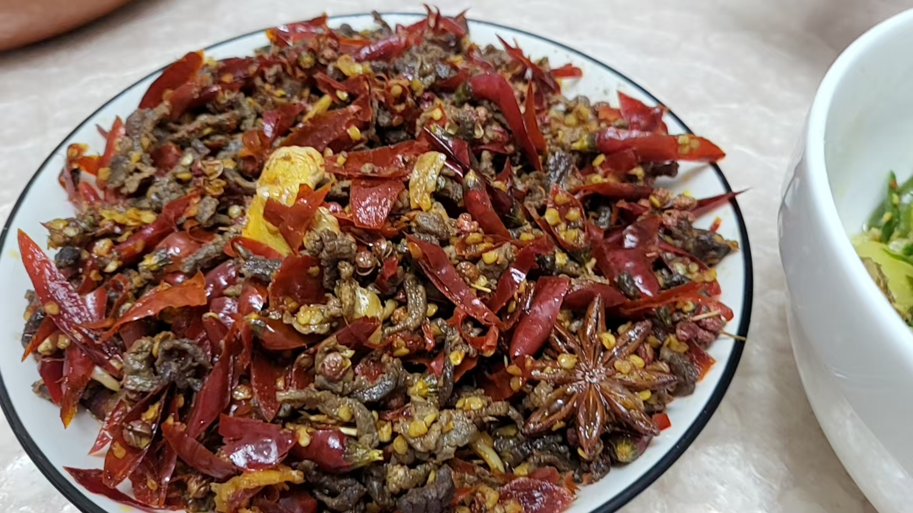

# 麻辣牛肉丝

麻辣牛肉丝上手难度比较简单, 口味麻辣, 适合口味较重人群, 如果放凉之后作为下酒菜更是完美替代花生米的存在, 除了买牛肉比较贵一点而已.

预估烹饪难度：★★★

## 必备原料和工具

- 嫩牛肉
- 姜片 
- 蒜瓣
- 生抽
- 老抽
- 料酒 
- 白糖 
- 淀粉 
- 鸡精 
- 味精 
- 盐
- 八角
- 香叶
- 干红花椒
- 干辣椒

## 计算

以 500g 牛肉为例,部分原料的去量计算说明
* 姜片 3-5 片, 每片厚度大约身份证厚度
* 蒜瓣 3-5 颗
* 白糖 小汤匙小半勺
* 淀粉 小汤匙小半勺
* 八角 一颗
* 香叶 一片
* 干红花椒 依个人口味决定用量 (喜吃麻的话可以大量添加, 尤其是喜欢花椒一起吃的, 推荐汉源花椒味道更足)
* 干辣椒 同样的依个人口味决定用量, 口味越重量越多, 根据我的经验, 使用过的干辣椒中, 满天星辣味更足, 炒出来会有一股奶香味, 但是吃下去就能够满地打滚, 本文档成品图片是正常饭碗一饭碗的干辣椒, 装至冒尖无法再装
* 食用油 50g
* 料酒 10g
* 生抽 20g
* 老抽 5g
* 淀粉 3g

## 操作

- 牛肉切细丝，冷冻一下的牛肉更好切
- 干辣椒切丝，不好切可使用剪刀剪，记得戴手套
- 将切好的牛肉使用料酒，生抽，老抽，淀粉腌制大概半小时
- 起锅烧油，将腌制好的牛肉炒至变色捞出
- 锅中留底油，爆香姜片，蒜瓣，八角，香叶
- 倒入干辣椒，花椒，炒出香味
- 倒入牛肉，继续炒制
- 加入其他调味料，鸡精味精盐
- 起锅装盘

## 附加内容

- 油温过高牛肉可能会粘锅
- 此法也可以将牛肉换成其他诸如兔肉等

如果您遵循本指南的制作流程而发现有问题或可以改进的流程，请提出 Issue 或 Pull request 。